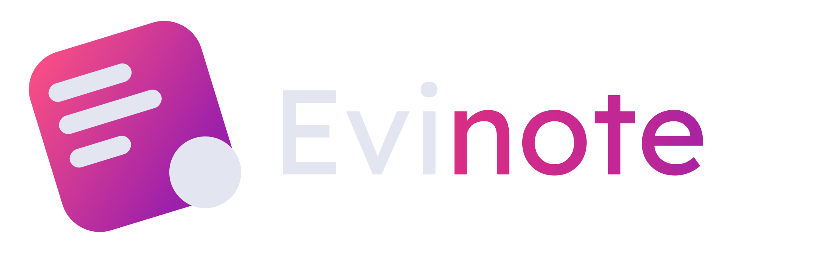

Notetaking and information sharing webapp made with sveltekit and postgres. ✨

## links
* [Kanban](https://github.com/users/L4PRY/projects/1)
* [Specification sheet](/../../issues/5)
* [DB Schema](/../../issues/1)
* [Desktop application C#](https://github.com/davidlados511/EvinoteAlk)

## main active branches:
* [frontend](https://github.com/L4PRY/Evinote/tree/frontend)
* [notes-notes-canvas](https://github.com/L4PRY/Evinote/tree/feat-notes-canvas)
* [backend](https://github.com/L4PRY/Evinote/tree/backend)

## setup devenv
prequisites:
- [docker](https://docker.com)
- [node.js](https://nodejs.org/en/download/)

### 1. install dependencies

```bash
npm install
```

### 2. start database
```bash
npm run docker:db:start
```

### 3. push schema to database

```bash
npm run db:push
```

### 4. start dev server

```bash
npm run dev
```

made wit luv by patrik, lados and matyi ❤️
